# Qwen2.5-0.5B v47 Linux 服务器部署与正式验收手册

_适用范围：AloePri v47、单张 NVIDIA GPU、Linux x86_64；最后核验日期：2026-08-12_

---

## 📋 部署结论

本轮只部署 `Qwen2.5-0.5B-Instruct`。正式验收机分为两类：

| 目标 | 推荐实例 | 原因 | 结果范围 |
| --- | --- | --- | --- |
| 完整 HF、vLLM、SGLang | RTX 4090 24 GB、驱动 580 | 已测引擎栈使用 CUDA 13 | 可跑全部 v47 阶段 |
| 仅 HF、攻击、精度和产品闭环 | RTX 3090 24 GB、驱动 530 | 成本低，显存充足 | 不跑当前 CUDA 13 引擎栈 |
| 不建议作为统一验收机 | RTX 4070 12 GB | 引擎和长生成余量较小 | 只适合短冒烟 |
| 不建议作为后续统一机器 | V100 16 GB | FP64 强，但不支持后续 BF16 路线 | 仅适合当前 FP32/FP64 研究 |

当前仓库已补齐 Linux 入口。服务器不得直接执行 `uv sync --frozen`：当前锁文件在 Linux
会选择 CUDA 12.8 构建，而驱动 530 机器应使用本手册固定的 CUDA 12.1 核心环境。NVIDIA
说明 CUDA 12.1 GA 对应 Linux 驱动 `530.30.02`；CUDA 13 的最低驱动分支为 580。[^1][^2]

```mermaid
flowchart LR
    accTitle: Qwen0.5B Cloud Acceptance Flow
    accDescr: Exact deployment flow from local bundle creation through Linux preflight, formal experiments, accelerated backend checks, and evidence download

    build[Build four bundles] --> upload[Upload and verify]
    upload --> core[Install CUDA 12.1 core]
    core --> verify[Verify model package]
    verify --> attacks[Complete formal TFMA and SDA]
    attacks --> accuracy[Complete missing benchmarks]
    accuracy --> product[Run product gates]
    product --> engines{Driver 580?}
    engines -->|Yes| compatibility[Run vLLM and SGLang]
    engines -->|No| hf_only[Record HF-only scope]
    compatibility --> final[Build final acceptance]
    hf_only --> final

    classDef process fill:#dbeafe,stroke:#2563eb,stroke-width:2px,color:#1e3a5f
    classDef decision fill:#fef9c3,stroke:#ca8a04,stroke-width:2px,color:#713f12
    classDef success fill:#dcfce7,stroke:#16a34a,stroke-width:2px,color:#14532d
    class build,upload,core,verify,attacks,accuracy,product,compatibility,hf_only process
    class engines decision
    class final success
```



### 本次代码审查确认的修复

| 问题 | 原状态 | 当前处理 |
| --- | --- | --- |
| Linux 依赖 | `uv.lock` 固定 CUDA 12.8 | 新增 CUDA 12.1 独立环境脚本 |
| 主编排 | 只有 PowerShell | 新增分阶段 Bash 编排 |
| MMLU/C-Eval | YAML 含 `E:\AloePri` 绝对路径 | 上传后按 Linux 数据路径重写 |
| HumanEval dtype | 私有模型显式 `float32` 会被拒绝 | 私有侧改为 `auto`，记录实际 dtype |
| HumanEval 比较 | 比较命令参数字符串 | 改为比较实际加载 dtype |
| 费用记录 | 没有逐阶段时间 | 每阶段写 UTC 起止和秒数 |
| vLLM/SGLang | WSL 脚本硬编码 v31 | 新增 v47 Linux CUDA 13 脚本 |
| 上传包 | 模型、代码和密钥混在一起 | 拆成源代码、模型数据、秘密密钥、已有证据四包 |

### 运行前仍需人工完成的外部条件

- 在 CCI3 数据集页面接受访问条款并准备 `HF_TOKEN`；该数据集必须登录并同意条件后才能访问。[^3]
- 从 MedDialog 官方数据来源取得 `processed.zh` 训练文件；数据卡列出了 `processed.zh` 配置。[^4]
- 若要执行当前已测的 `vLLM 0.26.0` 和 `SGLang 0.5.17`，选择驱动 580 的实例。
- 完整引擎环境建议把数据盘从 50 GB 扩到至少 100 GB；50 GB 只跑 HF 核心流程。

## 📦 本地打包与上传

### 1. 在本地 Windows 构建四个包

执行位置：`E:\AloePri`。

```powershell
Set-Location E:\AloePri
uv run python scripts/build_qwen05b_cloud_bundle.py `
  --out-dir release/qwen05b-cloud
Get-Content release/qwen05b-cloud/bundle-set.json
```

输出目录：

```text
release/qwen05b-cloud/
├── AloePri-qwen05b-v47-source.tar.gz
├── AloePri-qwen05b-v47-model-data.tar.gz
├── AloePri-qwen05b-v47-secret-keys.tar.gz
├── AloePri-qwen05b-v47-existing-evidence.tar.gz
└── bundle-set.json
```

四个包的边界：

| 包 | 内容 | 是否敏感 |
| --- | --- | --- |
| `source` | `src`、`scripts`、`configs`、`tests`、部署模板 | 否 |
| `model-data` | 原模型、v47 私有 checkpoint、MMLU/C-Eval 数据 | 按模型资产管理 |
| `secret-keys` | 完整、在线、离线密钥 | 是 |
| `existing-evidence` | 已完成的v47公式、Direct、VMA、IA、IMA、ISA和known-plaintext证据 | 是 |

不得上传整个本机`artifacts/`目录；只上传构建器明确列入manifest的已有证据包。IFEval工件的
provenance包含绝对路径、脚本SHA-256和运行时，Windows的8条不能在Linux上继续写，云端从
`0/541`建立统一正式工件。已有攻击证据不会重新运行。

### 2. 创建服务器并设置磁盘

租用时只选择一张 GPU。完整路径推荐：

```text
GPU: RTX 4090 24 GB
Driver: 580.159.04
CPU: 24 vCPU
RAM: 62 GB
Data disk: expand to 100 GB
OS: Ubuntu 22.04/24.04 x86_64
Visible GPU count: 1
```

服务器首次登录后执行：

```bash
sudo apt-get update
sudo apt-get install -y ca-certificates curl git jq nginx openssl rsync tmux
sudo mkdir -p /data/upload /data/.cache /data/tmp
sudo chown -R "$USER":"$USER" /data
df -h /data
nvidia-smi
```

成功条件：`/data` 可用空间至少 90 GB，`nvidia-smi` 只显示分配给当前实例的一张 GPU。

### 3. 从本地上传

在本地 Windows 执行；替换 `<host>`、`<port>` 和 `<user>`：

```powershell
scp -P <port> release/qwen05b-cloud/* `
  <user>@<host>:/data/upload/
```

`secret-keys` 只允许上传到正式评测机，不上传到最终对外服务机。

### 4. 先验源代码包，再验其余包

在服务器执行：

```bash
cd /data/upload
tar -xzf AloePri-qwen05b-v47-source.tar.gz -C /data
cd /data/AloePri
python3 scripts/verify_qwen05b_cloud_bundle_set.py \
  --bundle-set /data/upload/bundle-set.json \
  --archive-dir /data/upload
```

期望输出：

```json
{
  "pass": true,
  "failures": []
}
```

校验通过后再解压：

```bash
cd /data/upload
tar -xzf AloePri-qwen05b-v47-model-data.tar.gz -C /data
tar -xzf AloePri-qwen05b-v47-secret-keys.tar.gz -C /data
tar -xzf AloePri-qwen05b-v47-existing-evidence.tar.gz -C /data
chmod 600 AloePri-qwen05b-v47-secret-keys.tar.gz
chmod 600 AloePri-qwen05b-v47-existing-evidence.tar.gz
find /data/AloePri/data/keys -type f -exec chmod 600 {} \;
cd /data/AloePri
python3 scripts/verify_qwen05b_cloud_bundle_set.py \
  --bundle-set /data/upload/bundle-set.json \
  --archive-dir /data/upload \
  --extracted-root /data/AloePri
```

最后一条命令会逐文件核对四个内嵌 manifest 的路径、大小和 SHA-256，并拒绝路径穿越、重复文件或多余 manifest；必须再次得到 `"pass": true` 才能安装环境。

## 🔧 核心环境与预检

### 1. 安装 CUDA 12.1 核心 Python 环境

```bash
cd /data/AloePri
export ALOEPRI_DATA_VOLUME=/data
bash scripts/cloud/bootstrap_qwen05b_cuda121.sh
```

脚本创建：

```text
/data/AloePri/.venv-qwen05b-cu121
/data/.cache/uv
/data/.cache/huggingface
/data/.cache/torch
/data/AloePri/artifacts/cloud/qwen05b-v47/preflight.json
```

预检必须全部为 `true`：Linux、CUDA、单 GPU、显存、RAM、磁盘、输入文件、私有 checkpoint
manifest。任何一项失败都停止，不进入计费较高的正式实验。

### 2. 单独执行预检和代码测试

```bash
cd /data/AloePri
tmux new -s aloepri-v47
bash scripts/cloud/run_qwen05b_v47_acceptance.sh preflight
bash scripts/cloud/run_qwen05b_v47_acceptance.sh static
bash scripts/cloud/run_qwen05b_v47_incremental.sh package
```

`package`只构建净化server package并扫描是否存在密钥或未列入manifest的文件；已经完成的
公式与运行时验证从已有证据包恢复，不重复消耗GPU。

成功产物：

```text
artifacts/verification/qwen05b-candidate-v47-best-single/
data/server-packages/qwen05b-candidate-v47-best-single/
artifacts/cloud/qwen05b-v47/stage-timings.tsv
```

## 🧪 正式实验顺序

### 1. 准备正式隐私语料

先在 CCI3 页面接受数据条款，再在服务器设置 token。MedDialog 文件应放在 `/data/input`，
不要放进 Git 仓库。

```bash
mkdir -p /data/input
chmod 700 /data/input
export HF_TOKEN='<hugging-face-read-token>'
export MEDDIALOG_PROCESSED_ZH_FILE=/data/input/meddialog-processed.zh-train.json
bash scripts/cloud/run_qwen05b_v47_attacks.sh corpora
```

检查：

```bash
jq '.formal_corpus_complete, .explicitly_skipped' \
  data/eval/privacy/frequency/manifest.json
```

必须输出 `true` 和空数组。否则 TFMA/SDA 只能算冒烟，不能进入正式验收。

### 2. 只补正式TFMA和SDA

如果`corpora`已完成，只执行以下四个阶段：

```bash
bash scripts/cloud/run_qwen05b_v47_attacks.sh observations
bash scripts/cloud/run_qwen05b_v47_attacks.sh tfma
bash scripts/cloud/run_qwen05b_v47_attacks.sh sda
```

不得执行`run_qwen05b_v47_attacks.sh all`。Direct、VMA、IA、IMA、ISA和known-plaintext已经有
当前v47正式工件；即使其中有门禁FAIL，也不为了改变结果重复运行。

### 3. 运行 MMLU、C-Eval 和 PIQA

```bash
bash scripts/cloud/run_qwen05b_v47_acceptance.sh accuracy-mc
```

三套任务虽已有原始输出，但旧比较混用了BF16 baseline和FP32 candidate，且旧运行脚本SHA-256
不再等于修复后的runner，因此属于“正式证据未完成”，本次两侧重建不是重复刷分。

脚本先把本机 YAML 中的 Windows parquet 路径重写为当前 Linux 绝对路径，再按下列规则运行：

| 侧别 | dtype 参数 | 实际目的 |
| --- | --- | --- |
| 明文基线 | `float32` | 固定 FP32 基线 |
| v47 私有模型 | `auto` | 保留 FP32 权重和配置中的 FP64 Attention |

每个任务的比较器按 `doc_hash` 做逐题配对并生成 10,000 次 bootstrap 区间。

### 4. 运行 IFEval

```bash
bash scripts/cloud/run_qwen05b_v47_acceptance.sh ifeval
```

参数固定为：541 条、`max_new_tokens=1280`、batch 2、FP32、SDPA、75% allocator 上限，
至少保留 3 GiB 空闲显存。每 2 条原子保存一次。

查看进度：

```bash
jq '.samples | length' artifacts/eval/v47-final-ifeval-candidate.json
tail -f artifacts/cloud/qwen05b-v47/logs/ifeval.stdout.log
```

进程异常退出后，使用同一目录、同一代码、同一环境重跑相同命令即可断点续跑。更换脚本、模型、
key、dtype、batch、GPU 运行时或绝对路径后，provenance 会拒绝续写；此时必须归档旧 JSON 后重跑。

### 5. 运行 HumanEval

```bash
bash scripts/cloud/run_qwen05b_v47_acceptance.sh humaneval
```

生成 164 题后，`evaluate_humaneval_wsl.py` 在 Linux 上自动改用本机隔离 Python，不调用 WSL。
执行器限制 CPU、地址空间、文件大小，禁用网络和文件写入。私有模型使用 `--dtype auto`，但
比较器读取实际 `model_dtype`，不再把参数字符串 `auto` 与 `float32` 误判为不同 dtype。

### 6. 运行产品闭环和 HF 性能

```bash
bash scripts/cloud/run_qwen05b_v47_acceptance.sh product
bash scripts/cloud/run_qwen05b_v47_acceptance.sh performance
```

`product` 启动 loopback API，执行 100 条中英文问答、错误 key/model/越界 token、SSE、请求抓包、
日志明文扫描和 server package 密钥扫描。`performance` 按 ABBA+BAAB 启动 8 个独立进程，形成
80 对请求，报告 TTFT/TPOT p50、p95、p99 和配对区间。

## ⚙️ vLLM 与 SGLang

当前实际验证过的环境是 `vLLM 0.26.0 + torch 2.11 CUDA 13` 和
`SGLang 0.5.17 + sglang-kernel 0.4.5 + torch 2.11 CUDA 13`。因此本节只在驱动 580 的实例运行。
vLLM 官方文档说明不同版本的预编译 wheel 会固定 CUDA 构建，使用不同 CUDA 时需要选择匹配
wheel 或自行编译。[^5]

### 1. 安装两个隔离环境

```bash
cd /data/AloePri
export ALOEPRI_DATA_VOLUME=/data
bash scripts/cloud/bootstrap_qwen05b_engines_cuda13.sh
```

环境位置：

```text
/data/venvs/aloepri-vllm-0.26
/data/venvs/aloepri-sglang-0.5.17
```

### 2. 运行兼容性

```bash
bash scripts/cloud/run_qwen05b_v47_compatibility.sh
```

该命令执行：

1. vLLM 32-token greedy
2. 同机 HF 与 vLLM 32-token 比较
3. 一条真实 IFEval 长生成比较
4. SGLang 32-token greedy
5. vLLM 与 SGLang token 逐个比较

正式产物：

```text
artifacts/compatibility/v47-ifeval-hf-vllm-smoke.json
artifacts/compatibility/v47-vllm-sglang-32tokens.json
```

## 🚀 最终验收与服务发布

### 1. 构建最终验收

```bash
bash scripts/cloud/run_qwen05b_v47_acceptance.sh acceptance
jq '.decision, .summary' artifacts/acceptance/qwen05b-v47-final.json
```

退出码 `2` 表示证据齐全但存在未通过门禁，或证据缺失；这不是脚本崩溃。必须保留 JSON 中的
逐项失败原因。当前 v47 旧工件已经显示若干攻击和精度门禁失败，换 GPU 不会自动改变模型质量；
云端重跑的作用是建立同一版本、同一运行协议的正式证据。

### 2. 下载证据

在服务器执行：

```bash
cd /data/AloePri
tar -czf /data/aloepri-qwen05b-v47-evidence.tar.gz \
  artifacts/acceptance artifacts/accuracy artifacts/eval \
  artifacts/privacy/v47 artifacts/product/v47 \
  artifacts/performance/v47 artifacts/compatibility \
  artifacts/cloud/qwen05b-v47
sha256sum /data/aloepri-qwen05b-v47-evidence.tar.gz
```

在本地执行：

```powershell
scp -P <port> <user>@<host>:/data/aloepri-qwen05b-v47-evidence.tar.gz `
  E:\AloePri\artifacts\cloud\
```

### 3. 部署对外服务

正式评测机包含完整 key，不应直接变成对外服务机。最稳妥做法是新建干净实例，只上传
`source`、净化后的 server package 和服务配置；服务器不上传 `online_key` 或完整 key。

创建服务用户并安装模板：

```bash
sudo useradd --system --home /data/AloePri --shell /usr/sbin/nologin aloepri || true
sudo mkdir -p /etc/aloepri
openssl rand -hex 32 | sudo tee /etc/aloepri/bearer-token >/dev/null
sudo cp deploy/env/qwen05b.env.example /etc/aloepri/qwen05b.env
sudo cp deploy/systemd/aloepri-qwen05b.service /etc/systemd/system/
sudo chown -R aloepri:aloepri /data/AloePri
sudo chmod 600 /etc/aloepri/qwen05b.env
```

把 `/etc/aloepri/bearer-token` 的值填入 `ALOEPRI_BEARER_TOKEN`。服务只监听
`127.0.0.1:8000`，外部连接必须走 Nginx TLS。替换域名并启用：

```bash
sudo sed 's/ALOEPRI_DOMAIN/model.example.com/g' \
  deploy/nginx/aloepri-qwen05b.conf | \
  sudo tee /etc/nginx/sites-available/aloepri-qwen05b >/dev/null
sudo ln -s /etc/nginx/sites-available/aloepri-qwen05b \
  /etc/nginx/sites-enabled/aloepri-qwen05b
sudo nginx -t
sudo systemctl daemon-reload
sudo systemctl enable --now aloepri-qwen05b
sudo systemctl reload nginx
curl -fsS http://127.0.0.1:8000/healthz
```

TLS 证书必须先按实际域名签发；模板默认读取
`/etc/letsencrypt/live/<domain>/fullchain.pem` 和 `privkey.pem`。

客户端仍在本地持有在线 key：

```powershell
uv run aloepri chat `
  --server https://model.example.com `
  --key-dir data/keys/qwen05b-candidate-v47-best-single-online
```

## 🛠️ 故障处理

| 现象 | 原因 | 处理 |
| --- | --- | --- |
| `existing IFEval artifact provenance differs` | 上传了本机工件或改变了运行条件 | 归档云端旧工件，从 0 开始 |
| `GPU reserve fell below 3.00 GiB` | 其他进程占卡或显存不足 | `nvidia-smi` 清理进程；不要降低正式余量 |
| MMLU 找到 `E:\AloePri` | 未运行路径重写 | 重新执行 `accuracy-mc` |
| HumanEval 拒绝 dtype | 使用了旧脚本 | 确认私有侧参数为 `auto` |
| CCI3 401/403 | 未接受条款或 token 无权 | 在网页接受条款，换有权限的 `HF_TOKEN` |
| `formal_corpus_complete=false` | 跳过 CCI3/MedDialog | 不运行正式 TFMA/SDA，先补语料 |
| CUDA 13 初始化失败 | 驱动低于 580 | 换驱动 580 实例或只跑 HF |
| SGLang 找不到 `nvcc` | cu13 toolkit 链接未建 | 重跑引擎 bootstrap 和兼容脚本 |
| 50 GB 磁盘不足 | 两个引擎环境和缓存占用大 | 扩到 100 GB；缓存必须在 `/data` |

## 🔗 代码入口清单

| 入口 | 用途 |
| --- | --- |
| `scripts/build_qwen05b_cloud_bundle.py` | 本地拆分上传包 |
| `scripts/verify_qwen05b_cloud_bundle_set.py` | 上传后 SHA-256 校验 |
| `scripts/cloud/bootstrap_qwen05b_cuda121.sh` | HF/攻击/精度核心环境 |
| `scripts/cloud/preflight_qwen05b.py` | GPU、磁盘、模型、key 预检 |
| `scripts/cloud/run_qwen05b_v47_acceptance.sh` | 核心验收分阶段入口 |
| `scripts/cloud/run_qwen05b_v47_attacks.sh` | 全攻击入口 |
| `scripts/cloud/bootstrap_qwen05b_engines_cuda13.sh` | vLLM/SGLang 环境 |
| `scripts/cloud/run_qwen05b_v47_compatibility.sh` | 三后端兼容性 |
| `scripts/summarize_cloud_runtime_cost.py` | 按真实秒数结算费用 |
| `configs/cloud/qwen05b_v47_cost_plan.yaml` | 计划小时和单价 |

## 🔗 References

[^1]: NVIDIA. “CUDA 12.1 Release Notes.” https://docs.nvidia.com/cuda/archive/12.1.0/cuda-toolkit-release-notes/

[^2]: NVIDIA. “Minor Version Compatibility.” https://docs.nvidia.com/deploy/cuda-compatibility/minor-version-compatibility.html

[^3]: BAAI. “CCI3-Data Dataset Card.” https://huggingface.co/datasets/BAAI/CCI3-Data

[^4]: UCSD26. “MedDialog Dataset Card.” https://huggingface.co/datasets/UCSD26/medical_dialog

[^5]: vLLM Project. “GPU Installation.” https://docs.vllm.ai/en/v0.7.0/getting_started/installation/gpu/

---

_最后核验：2026-08-12；服务器尚未实际租用，本手册已完成本地静态和无 GPU 入口检查，云端 GPU 结果以服务器新工件为准。_
